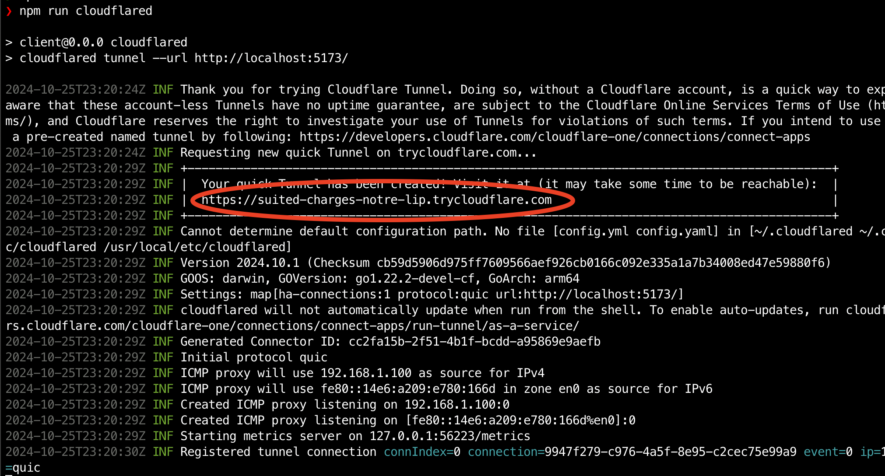

# KAPLAY + Colyseus

这个仓库是基于 [Nanyushan/KAPLAY_COLYSEUS](https://github.com/Nanyushan/KAPLAY_COLYSEUS.git) 的源码，并在此基础上添加了功能和进行优化修改。

它提供了一个快速入门的样板项目，结合了 [KAPLAY](https://kaplayjs.com/) 和 [Colyseus](https://colyseus.io/) 多人游戏框架。

> 最初是为第一次 [KAJAM](https://itch.io/jam/kajam) + Colyseus 挑战/协作制作的。

## 运行本地环境

本仓库包含客户端和服务器代码。要下载依赖并运行，请按照下面的步骤操作。

首先在根目录克隆本项目：

```bash
git clone https://github.com/lin/kaplay-colyseus.git
cd kaplay-colyseus
```

然后分别进入客户端和服务器目录安装依赖并启动：

**Start the client:**

```bash
cd client
npm install
npm start
```

**Start the server:**

```bash
cd server
npm install
npm start
```

## Testing with friends

You will need to expose your local server to the internet to test with friends. We recommend using either [cloudflared](https://www.npmjs.com/package/cloudflared) or [ngrok](https://ngrok.com/) for this.

```
cd client
npm run cloudflared
```

You can copy the URL generated by `cloudflared` and share it with your friends:




## License

MIT

(_This project was slightly based on [tejaboy/discord-kaboom-colyseus](https://github.com/tejaboy/discord-kaboom-colyseus)_)
